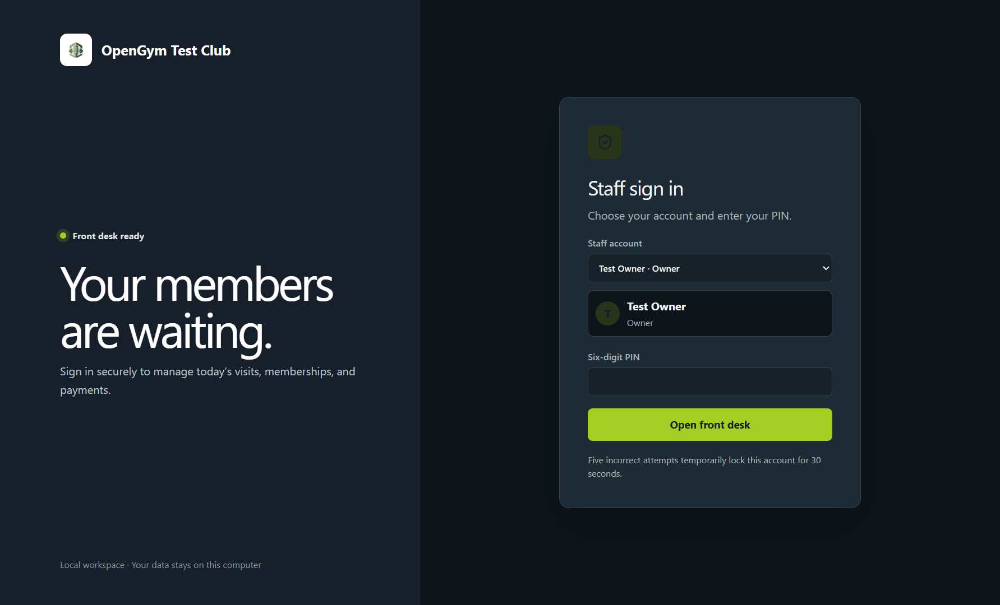
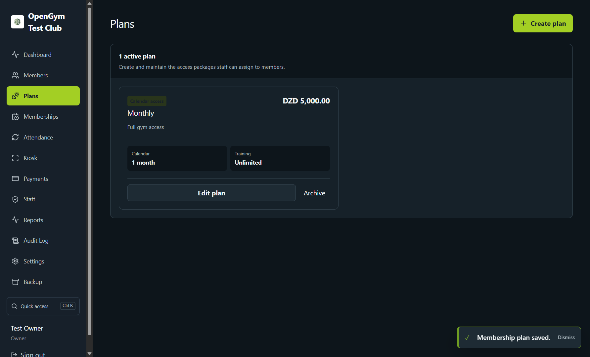
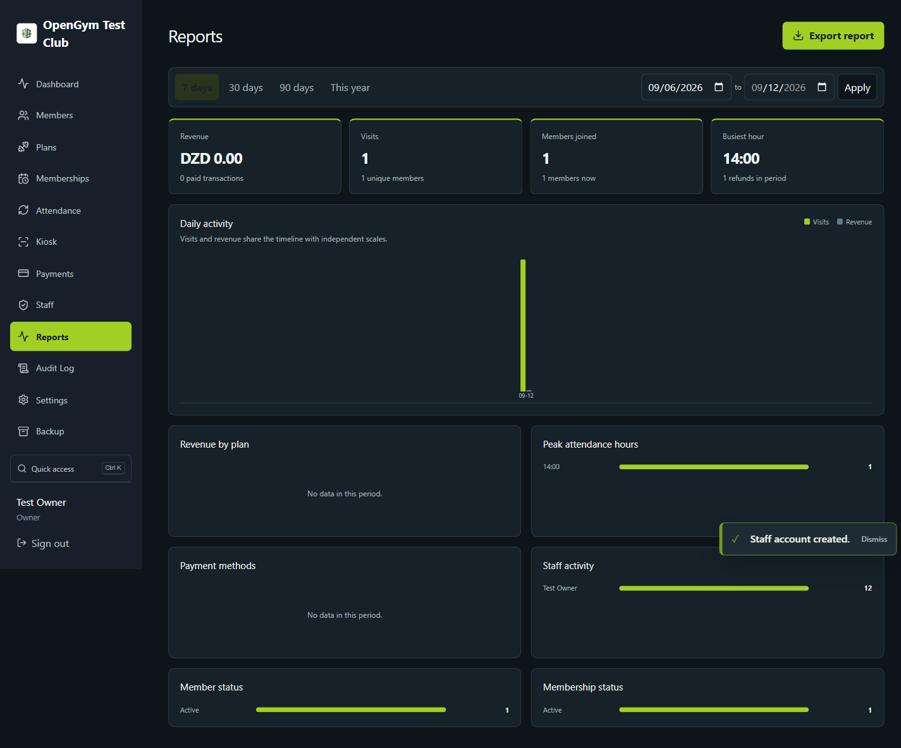
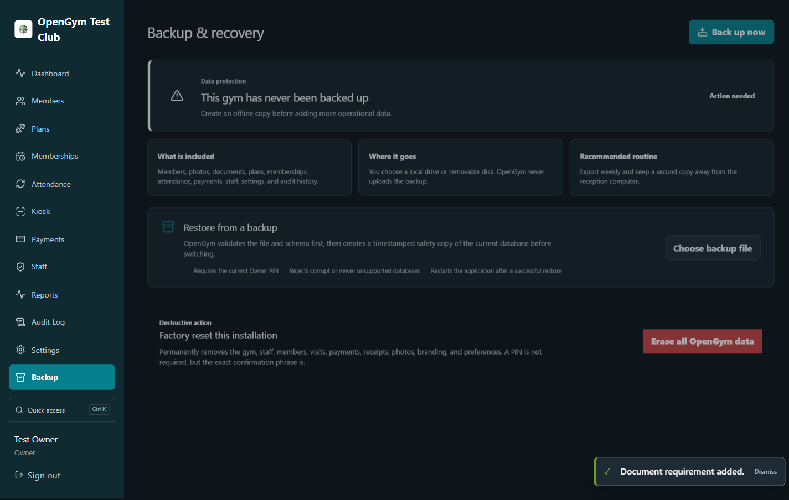
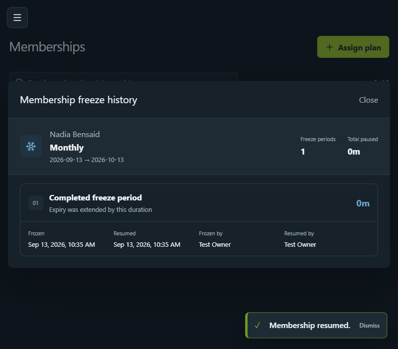

# OpenGym

[](https://github.com/flennium/OpenGym/actions/workflows/ci.yml)
[](LICENSE)
[](https://www.electronjs.org/)

OpenGym is an open-source, local-first desktop application for running a gym front desk. Member, membership, attendance, payment, receipt, staff, and backup data stays in one SQLite database on the local machine.

## Screenshots

| Secure staff sign-in                                               | Membership plans                                                     |
| ------------------------------------------------------------------ | -------------------------------------------------------------------- |
|  |  |

| Visual reports                                                  | Backup and recovery                                                                  |
| --------------------------------------------------------------- | ------------------------------------------------------------------------------------ |
|  |  |

### Exact freeze accounting



## Development

Requirements: Node.js 22+ and the native build tools required by Electron/better-sqlite3.

```bash
npm install
npm run dev
```

Quality checks:

```bash
npm run typecheck
npm test
npm run build
npm run pack
```

The production Electron workflow test launches a fresh isolated app and exercises setup, sign-in, member creation, plan assignment, attendance, payments, staff permissions, reports, themes, and responsive navigation:

```bash
npm run build
npm run rebuild:electron
node scripts/smoke.mjs
```

## Appearance

The Owner can choose light or dark mode and one of ten local themes: Pulse, Ocean, Ember, Violet, Rose, Gold, Mint, Sky, Coral, and Mono. Appearance choices are applied immediately and retained on the machine.

Appearance is available to every staff account; gym identity and regional settings remain Owner-only. Press `Ctrl+K` anywhere after signing in for quick keyboard navigation.

## Confirmations and feedback

OpenGym asks for confirmation before consequential changes such as archiving records, refunding payments, changing membership state, replacing a staff PIN, or restoring a database. The dialog explains what changes and what history remains preserved. Completed actions show a short success notification; failures remain visible long enough to read and correct.

The first launch opens a guided setup wizard. Gym and owner names remain free text, while currency, language/formatting, and timezone use labelled choices; there are no default credentials. New installations start in dark mode and can switch to light mode later.

## Gym branding and receipts

Owners can configure the gym logo, address, phone, email, tax or registration ID, receipt footer, paper size, and receipt accent color under **Settings > Gym identity and receipts**. The chosen logo also replaces the generic mark in the signed-in application sidebar.

Each payment stores a snapshot of the branding and regional settings used at the time it was recorded. Generated receipt PDFs therefore remain historically accurate even when the gym later changes its name, logo, contact details, or colors. Existing generated receipt files are never silently overwritten.

## Member kiosk

Each new member receives a unique 10-digit numeric chip ID. The **Kiosk** page accepts USB, RFID, NFC, barcode, and QR readers that operate as keyboard/HID scanners, records the visit, and displays the member's plan, expiry, remaining hours, and the gym closing time. The Owner can configure an automatic welcome timeout and a separate six-digit kiosk exit PIN, then start a locked fullscreen presentation from the Kiosk page.

Face recognition is disabled by default and can be enabled by the Owner. When enabled, staff can enroll a consenting member from the member form and the kiosk offers camera identification alongside chip scanning. Camera frames are processed locally; OpenGym stores a versioned 512-value face template in SQLite and does not retain the enrollment frame.

The bundled `buffalo_sc` models are from the InsightFace project and are intended for non-commercial research and learning use. InsightFace code and pretrained model terms are separate. Do not distribute a commercial OpenGym installation with these weights without obtaining the appropriate model rights. See [InsightFace licensing](https://github.com/deepinsight/insightface#license).

## Membership freezing

Freezing immediately blocks access and pauses calendar expiry. Resuming extends the exact expiration timestamp by the full frozen duration—without rounding to whole days. Every interval remains visible from **Memberships > Freeze history**, including freeze/resume times and the responsible staff accounts.

## Data and recovery

OpenGym stores `opengym.db` under Electron's per-user application-data directory. Use **Backup & recovery** inside the app to create a consistent database export or restore one. Restoring first preserves the current database as a timestamped safety copy.

## Security model

The renderer is context-isolated and has no Node.js access. All privileged actions cross an allow-listed preload bridge, are validated, and execute in the main process. PINs use salted scrypt hashes. The current database provider is SQLite and the MVP is intended for a trusted, single-machine environment; operating-system disk encryption remains recommended. MySQL/PostgreSQL require a shared-server architecture decision and are not represented as supported by a cosmetic selector.

## License

MIT

## Release signing

Local builds are unsigned. GitHub release builds can use Electron Builder's standard signing environment variables once maintainers add Windows and Apple release identities as repository secrets. See [docs/RELEASING.md](docs/RELEASING.md).

Contributions are welcome. Read [CONTRIBUTING.md](CONTRIBUTING.md) and report security issues according to [SECURITY.md](SECURITY.md).

For module ownership and extension points, see [docs/ARCHITECTURE.md](docs/ARCHITECTURE.md).
